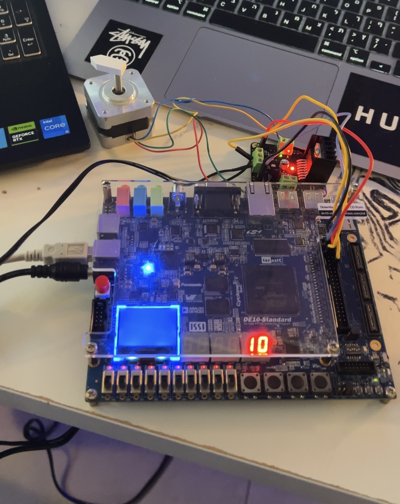
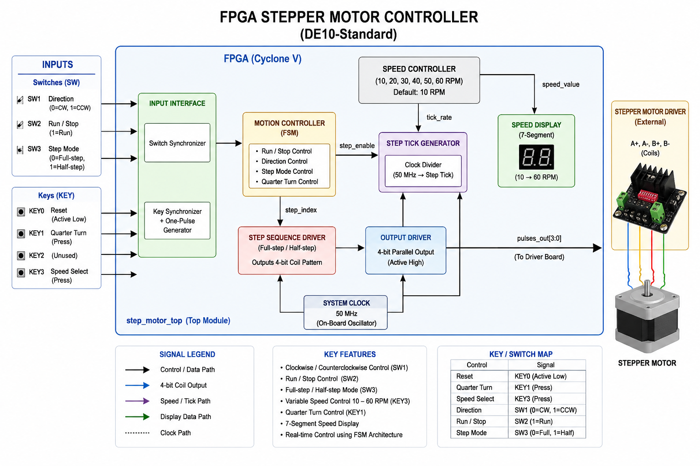

# FPGA Stepper Motor Controller:

A real-time FPGA-based stepper motor controller implemented in SystemVerilog on the DE10-Standard FPGA platform.
The project controls a bipolar stepper motor using configurable motion modes, variable speed control, and hardware-level state machine logic.

Features:
Clockwise / Counterclockwise rotation
Variable speed control (10–60 RPM)
Full-step and Half-step operation
Precise quarter-turn functionality
7-segment speed display
Hardware implementation on FPGA
External stepper motor driver interface

# Demonstration Video

[Watch the hardware demo on Google Drive](https://drive.google.com/drive/u/0/folders/1nrFBBEvt4XcYknZoaIi0xSqabtPG-4tD](https://drive.google.com/drive/folders/1nrFBBEvt4XcYknZoaIi0xSqabtPG-4tD?usp=drive_link))

Hardware Used:
Intel / Altera DE10-Standard FPGA Board
Bipolar Stepper Motor (SM-42BYG011-25)
External Motor Driver
External Power Supply

# Hardware Setup

# System Architecture:

Block Diagram:

Controls:

| FPGA Control | Function                        |
| ------------ | ------------------------------- |
| KEY0         | Active-low reset                |
| KEY1         | Quarter-turn operation          |
| KEY3         | Speed selection                 |
| SW1          | Direction control               |
| SW2          | Continuous Run / Stop           |
| SW3          | Full-step / Half-step selection |

Speed Control:
The motor speed changes in 10 RPM increments:
10 → 20 → 30 → 40 → 50 → 60 → 50 → 40 → ...
The current speed is displayed using HEX0 and HEX1.

Project Files:
src/
│
├── button_one_pulse.sv
├── motion_controller.sv
├── speed_controller.sv
├── speed_display.sv
├── seven_seg_digit.sv
├── step_sequence_driver.sv
├── step_tick_generator.sv
└── step_motor_top.sv

FPGA Pin Assignments:
| Signal  | FPGA Pin |
| ------- | -------- |
| CLOCK50 | PIN_AF14 |
| KEY0    | PIN_AJ4  |
| KEY1    | PIN_AK4  |
| GPIO0   | PIN_W15  |
| GPIO1   | PIN_AK2  |
| GPIO4   | PIN_AJ1  |
| GPIO5   | PIN_AJ2  |

Demonstration:
The project was successfully tested on real FPGA hardware with:

Continuous motor rotation
Direction switching
Speed control
Quarter-turn functionality
Full-step / Half-step operation

Demo videos and hardware images are included in the repository.

Technologies:
SystemVerilog
FPGA Design
Digital Logic Design
Finite State Machines (FSM)
Quartus Prime
ModelSim

Future Improvements:
Acceleration / deceleration ramping
Microstepping support
Closed-loop position feedback
UART control interface
Advanced motion profiles

Author:
Nadim Tali
Electrical Engineering Student
